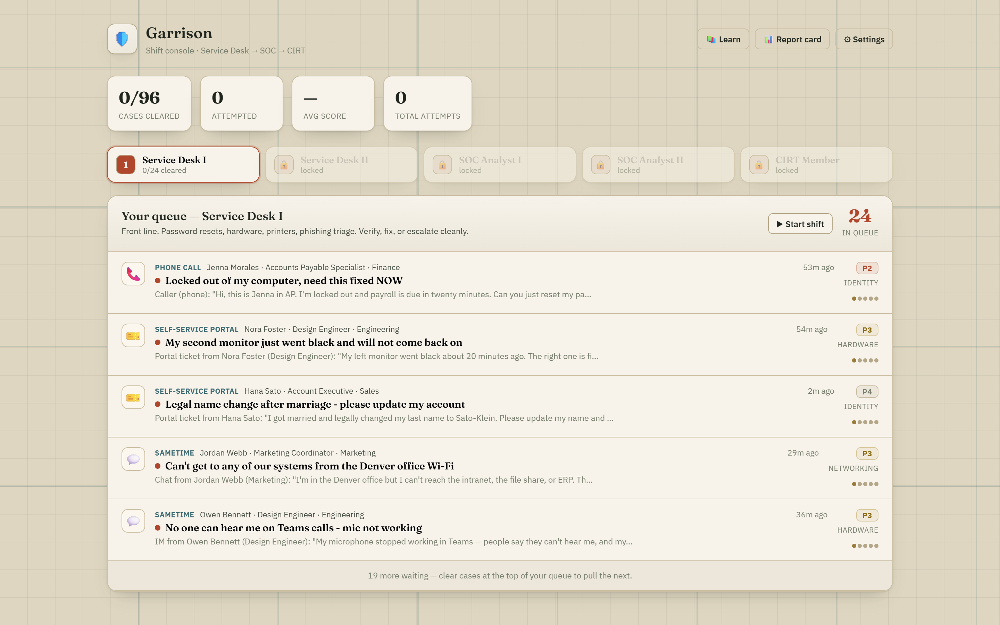
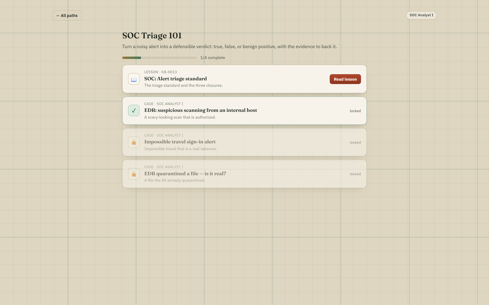
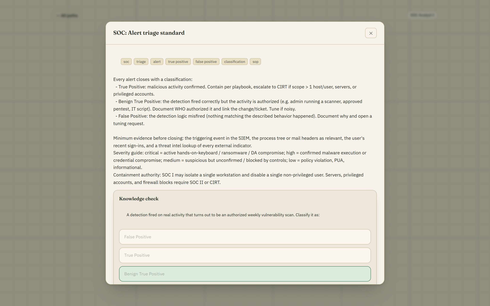
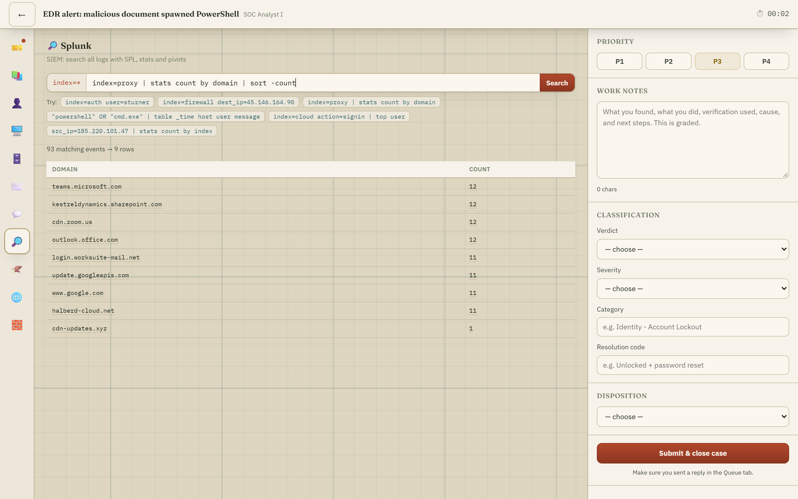
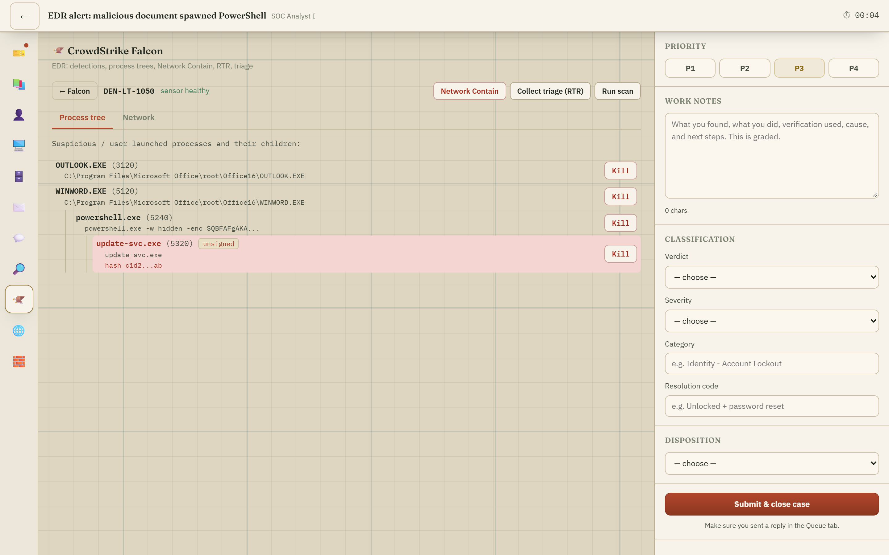
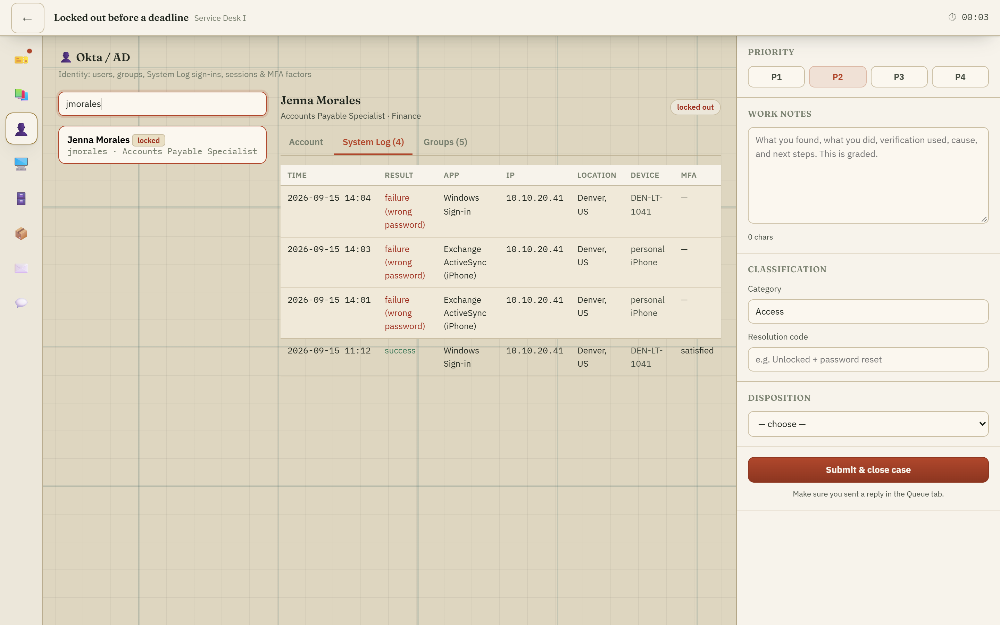
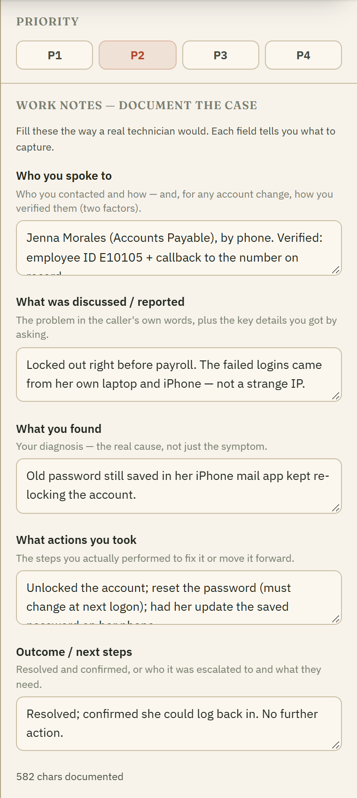
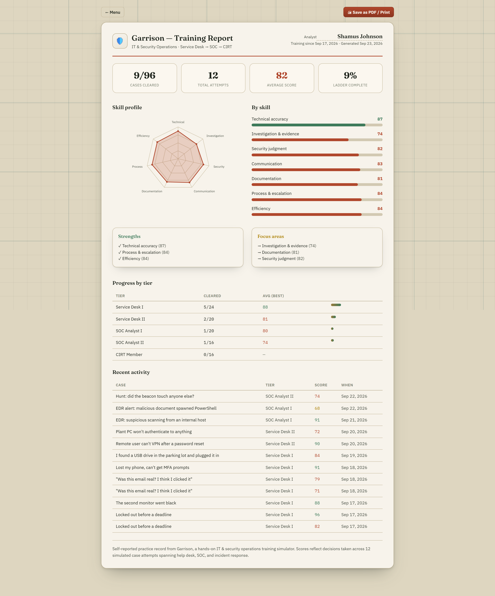

# 🛡️ Garrison

**Train · Triage · Escalate**

A browser-based training simulator that takes you from the IT help desk to the incident response team. Garrison drops you into a fictional company's ticket queue and SOC, hands you the same tools a real analyst uses, and grades every move — what you checked, what you did, the order you did it in, and how you closed it.

[](LICENSE)


> **What this is — and isn't.** Garrison is a **learning simulator**. Everything happens against a fictional company (Kestrel Dynamics) modelled entirely in the browser. It **connects to nothing**, touches no real systems, accounts, or networks, and stores your progress only in your own browser. It's a flight simulator for IT and security operations — practise the decisions before a real ticket, caller, or incident is on the line.

Cases arrive in a **shift queue** — email, SMS, Sametime, phone, self-service portal, and Splunk / CrowdStrike / DLP alerts — just like a real desk. You work what's at the top; the rest waits. Or hit **▶ Start shift** for an endless run that deals you case after case with a running score and streak, then a shift summary.



---

## Quickstart

```bash
git clone https://github.com/MooseArsenal/garrison.git
cd garrison
npm install
npm run dev          # open the printed URL (http://localhost:5180)
```

That's the whole setup — no database, no account, no backend. To build a static bundle you can host anywhere:

```bash
npm run build && npm run preview
```

---

## Why it exists

Breaking into cybersecurity has a chicken-and-egg problem: every job wants experience, and experience is hard to get before the job. Quiz sites test whether you *recognise* an answer. Garrison tests **what you actually do next** — one case threaded through real tools, where the wrong move (resetting a password before Security sees the sign-ins, isolating a domain controller over an authorised scan, wiring a wire transfer to an attacker) costs you the score the way it would cost you on the job.

- **A real career ladder** — Service Desk I → Service Desk II → SOC Analyst I → SOC Analyst II → CIRT. Each tier unlocks when you pass 75% of the one below.
- **Decisions, not trivia** — verify, investigate, contain, document, escalate, and communicate. Escalating correctly is a *win*; some cases are deliberately above your tier.
- **Honest grading** — seven skills scored per case (technical, investigation, security judgment, communication, documentation, process, efficiency) with a full debrief against a competent analyst's approach.
- **Industry-standard tools** — the workflows and terminology transfer straight to a real SOC.
- **Practice like a shift** — an endless mode deals case after case with a running score and streak, then an end-of-shift summary, so you can drill without clearing tiers.
- **Guided learning paths** — ordered curricula that pair each SOP (with a knowledge check) with the cases that apply it, so you learn the concept before you're tested on it.

---

## The career ladder

| Tier | Scenarios | What you practise |
|------|:---------:|-------------------|
| **Service Desk I** | 24 | Password/MFA resets, lockouts, hardware & printers, Wi-Fi, onboarding & offboarding, phishing triage, vishing, found-USB — verify the caller, fix it, or escalate cleanly. |
| **Service Desk II** | 20 | Driver/BSOD, cached-credential VPN traps, Kerberos clock skew, Group Policy, mapped drives, BitLocker recovery, access control, least-privilege pushback. |
| **SOC Analyst I** | 20 | Alert triage: true / false / benign classification, phishing campaigns, endpoint malware, password spray, MFA fatigue, credential-theft tools, ransomware canaries. |
| **SOC Analyst II** | 16 | Investigation & hunting: BEC, lateral movement, OAuth-consent & AiTM token theft, web-app attacks, Kerberoasting, DNS tunneling, data staging, cross-estate scoping. |
| **CIRT** | 16 | Incident command: ransomware & double extortion, domain & tenant compromise, insider sabotage, wire fraud, lost-device breach, OT/plant, APT dwell — lifecycle, evidence, and who to notify (and when). |

**96 scenarios** in all, and the roster keeps growing.

---

## Learning paths

Not sure where to start? **Learning paths** are guided mini-curricula that pair the playbook with practice: read the relevant SOP, pass a quick knowledge check, then work the cases that apply it. Steps unlock in order, so you build the concept before you're tested on it. There are paths for each tier, from *Service Desk Foundations* to *Incident Command*.



Each lesson is a real SOP with a one-question check that reinforces the rule:



---

## The tools

Garrison's consoles are styled after the products a real best-of-breed SOC runs, so the muscle memory carries over. Every scenario gives you the tools its tier would actually have.

| Console | Modelled on | What you do in it |
|---------|-------------|-------------------|
| **Splunk** | Splunk SIEM | Search every log with real **SPL** — `search`, `where`, `stats`, `table`, `top`, `sort`, `dedup`, and field pivots. |
| **CrowdStrike Falcon** | CrowdStrike EDR | Read process trees, **Network Contain** a host, run RTR triage, kill processes. |
| **ServiceNow** | ServiceNow ITSM | Work the incident record: priority, work notes, classification, disposition. |
| **Okta / AD** | Okta + Active Directory | Users, groups, the **System Log** of sign-ins, sessions and MFA factors. |
| **Proofpoint** | Proofpoint email security | Smart Search, header/SPF-DKIM-DMARC analysis, quarantine, mailbox rules. |
| **VirusTotal** | VirusTotal | Reputation and detection ratios for IPs, domains, hashes and URLs. |
| **Palo Alto** | Palo Alto NGFW | Firewall / proxy / mail-gateway / DNS-sinkhole blocks. |
| **Remote Desktop** | Windows console | Task Manager, Services, Event Viewer, Device Manager, and a **live terminal** with real commands. |
| **Knowledge Base** | internal SOPs | The playbooks and runbooks the grader holds you to. |

### Investigate like the real thing

Search a realistic, noisy multi-source log set (auth, dns, proxy, firewall, cloud, email, EDR, VPN, DHCP) in SPL, then pivot — the same query language you'll write on the job. Hunting here means filtering genuine noise, not spotting the one obvious line:



Read the process tree and contain the host in an EDR that behaves like Falcon:



Pull a user's sign-in history to tell a routine lockout from an attack:



---

## How grading works

Every case is scored purely from **what you did** — the log of your actions plus the closure form — against the approach a competent analyst would take. You get:

- a **0–100 score** and pass/fail (70 to pass),
- a **per-skill breakdown** across the seven skills,
- the **costly mistakes** that hurt you most and *why*,
- feedback on your reply to the requester, and a **debrief** that teaches the underlying lesson.

Taking a forbidden action (say, sending a password to a personal email, or notifying regulators without Legal) caps your score no matter how much else you got right — because it would in real life.

### Documentation is guided

New to a help desk or SOC and unsure *what* to write down? The work-notes panel isn't a blank box — it's the field template a real analyst fills in, with a one-line prompt under each field telling you what belongs there (and an example). Service Desk, SOC, and CIRT each get the template that fits the role, so you learn the shape of good documentation as you go.



### Track your progress

A shareable **training report** — overall score, a seven-skill radar, strengths versus focus areas, per-tier progress, and recent activity — that you can print or save as PDF. It's a self-reported practice record generated in your own browser, not a verified credential, but it's a concrete way to show an interviewer what you've been drilling.



---

## Project structure

```
src/
  engine/            the simulator core (no UI)
    world.ts         the fictional company: users, hosts, servers, logs, KB, intel
    types.ts         the Scenario schema
    grading.ts       seven-skill scoring from the action log + closure
    spl.ts           the Splunk SPL query engine
    terminal.ts      the Windows command emulator
  scenarios/         one file per tier — data, not code (sd1.ts, soc1.ts, …)
  ui/                React app: the tool consoles, work panel, briefing, debrief
docs/
  SCENARIO_AUTHORING.md   how to write a new scenario
scripts/
  validate.ts        proves every scenario is completable and grades correctly
```

Scenarios are **data**. Each one patches a copy of the world and declares, as matchers over the action log, what a good analyst checks, does, and must not do. Adding a scenario is adding one object — see [docs/SCENARIO_AUTHORING.md](docs/SCENARIO_AUTHORING.md).

### Every scenario is provably winnable

`npm run validate` synthesises the ideal analyst's actions from each scenario's own grading rules, runs the real grading engine, and asserts the run passes with a high score — while an empty attempt fails. If a scenario can't be completed with its documented tools, or grades wrong, the check fails instead of teaching you something false. All 96 pass.

---

## Tech stack

TypeScript · React 18 · Vite 5. No backend, no database — progress lives in `localStorage`. Styled in the shared **MooseArsenal campaign-map** theme (Fraunces + IBM Plex, topographic ink on map paper).

---

## Responsible use & trademarks

Garrison is an **independent training project** for personal skill development. The tool consoles are *styled after* well-known products so that skills transfer to real work — Splunk, CrowdStrike Falcon, ServiceNow, Okta, Proofpoint, VirusTotal, and Palo Alto Networks are trademarks of their respective owners. Garrison is **not affiliated with, endorsed by, or built from** any of them, and includes none of their software; the names identify the *style* being emulated, nothing more. All companies, users, hosts, and data in the simulator are fictional.

---

## License

MIT — see [LICENSE](LICENSE).
